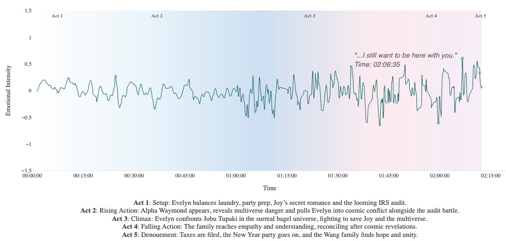

# Film Emotion Analyzer

A sophisticated tool that analyzes the emotional journey of films through their subtitles, creating beautiful visualizations of the emotional arcs and story structure.

## Features

- **Emotional Analysis**: Uses advanced NLP to analyze the emotional content of film dialogue
- **Five-Act Structure**: Automatically identifies the five-act structure of the film using OpenAI's GPT model
- **Dynamic Smoothing**: Applies act-specific smoothing to create natural emotional flows
- **Intensity Adjustment**: Adjusts emotional intensity based on dramatic structure
- **Beautiful Visualization**: Creates an ethereal, cinematic visualization of the emotional journey
- **Interactive Tooltips**: Elegant tooltips showing key moments and dialogue

This is an example of the emotional journey visualization of my favorite film of all time:*Everything Everywhere All At Once* generated by **Film Emotion Analyzer**:


## Technical Details

### Emotion Analysis
- Uses SentenceTransformer for semantic analysis
- Implements sophisticated sentiment scoring with positive/negative word embeddings
- Applies Gaussian smoothing with act-specific parameters

### Story Structure
- Analyzes script structure using OpenAI's GPT model
- Identifies five-act structure (Setup, Rising Action, Climax, Resolution, Denouement)
- Provides detailed descriptions for each act

### Visualization
- Built with Plotly for interactive HTML output
- Custom CSS for ethereal tooltip design
- Gradient background with cinematic color scheme
- Key moment markers with dialogue previews

## Installation

1. Clone the repository:
```bash
git clone https://github.com/yourusername/film-emotion-analyzer.git
cd film-emotion-analyzer
```

2. Install dependencies:
```bash
pip install -r requirements.txt
```

3. Set up OpenAI API key (optional):
```bash
export OPENAI_API_KEY='your-api-key'
```

## Usage

1. Prepare your subtitle file in .srt format

2. Run the analyzer:
```bash
python movie_sentiment_analyzer.py
```

3. Enter your OpenAI API key when prompted (or press Enter to use default analysis)

4. Enter the path to your subtitle file

5. The script will generate:
   - `emotion_curves.html`: Interactive visualization
   - `emotion_curves.png`: Static image of the emotional journey

## Requirements

- Python 3.7+
- sentence-transformers
- plotly
- pandas
- numpy
- pysrt
- openai
- scipy

## License

MIT License

## Contributing

Contributions are welcome! Please feel free to submit a Pull Request.

## Acknowledgments

- SentenceTransformer for semantic analysis
- OpenAI for script structure analysis
- Plotly for visualization capabilities 
